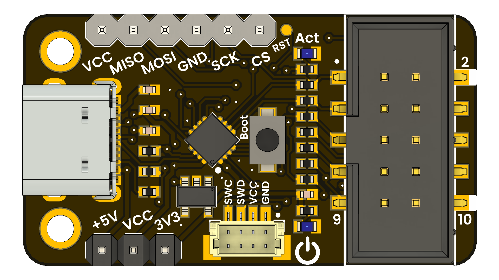

# DevLab: CH552 Multi-Protocol Programmer Module

  
  
  

The **CH552 Multi-Protocol Programmer Module** is a versatile and compact programming tool designed for developers and hobbyists working with various microcontroller architectures. It supports multiple programming protocols, including SWD, JTAG, UPDI, and USBasp, making it an ideal choice for programming AVR, ARM, and CPLD devices.

  

  

### Quick Setup

### Features

* USB Full-Speed (CDC/HID)
* Voltage selector: 3.3V / 5V
* SWD / JTAG / UPDI / USBasp support
* Works with popular tools (avrdude, OpenOCD, Quartus, etc.)

> **Warning:**  
> This programmer **requires specific firmware** depending on the protocol:
>
> - **AVR**: USBasp & UPDI  
> - **ARM**: CMSIS-DAP (SWD/JTAG)  
> - **CPLD**: USB-Blaster (JTAG)
> - **FTDI**: Bitbang mode (GPIO)
> - Please refer to the [Product Wiki](#) for detailed instructions on flashing the appropriate firmware.

## Applications
- Programming AVR microcontrollers (USBasp, UPDI)
- Programming ARM microcontrollers (CMSIS-DAP)
- Programming CPLDs (USB-Blaster)
- General-purpose USB to GPIO interface
- Educational tool for learning about microcontroller programming and interfacing

##  Resources

- [Schematics](hardware/unit_schematic_v_0_0_1_ue0102_PY32f003L24D6TR_devlab.pdf)
- [Datasheet](hardware/resources/PY32F003L24_datasheet.pdf)
- [Pinout](hardware/unit_pinout_v_0_0_2_ue0090_multi_protocol_programmer_en.pdf)

## License

All hardware and documentation in this project are licensed under the **MIT License**.  
Please refer to [`LICENSE.md`](LICENSE.md) for full terms.

  Template created by UNIT Electronics 

